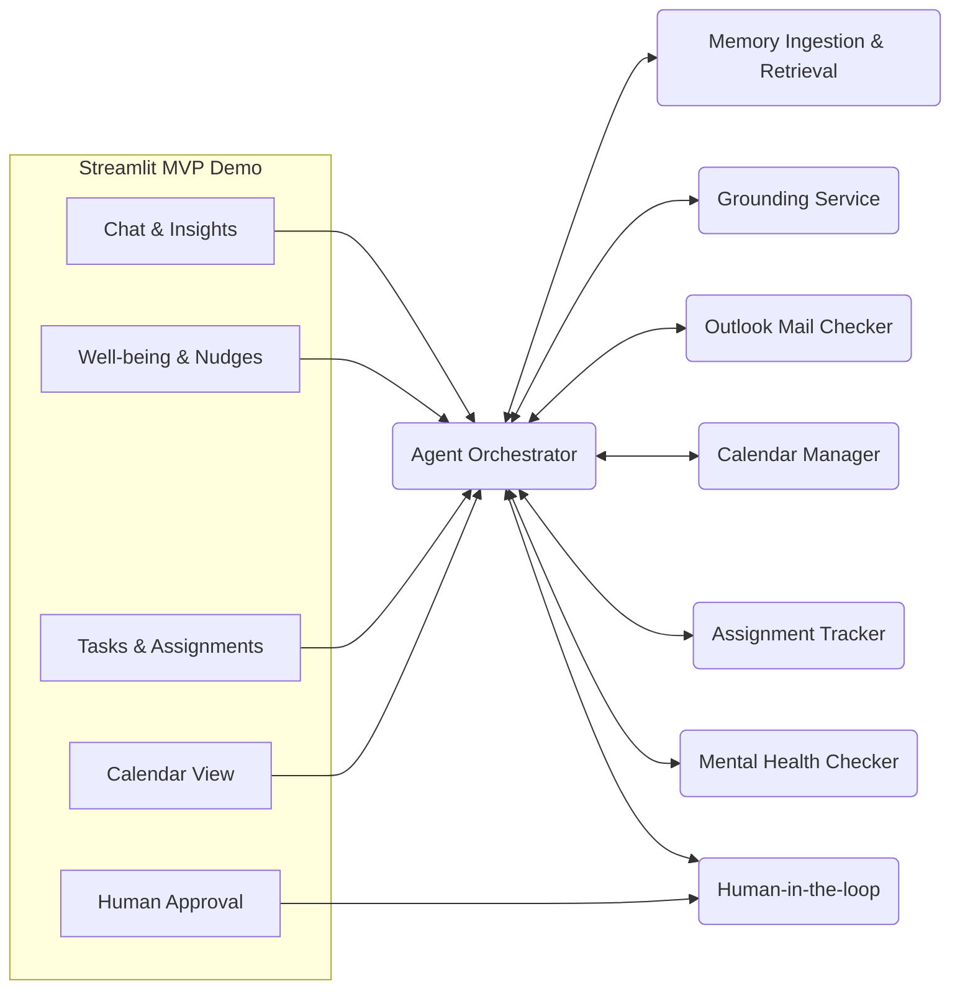

# AI Buddy: Your Proactive Personal Companion Against Loneliness

**Tagline:** AI Buddy is a multi‑agent personal companion designed to proactively combat loneliness by providing personalized assistance, support, and engagement through intelligent scheduling, task management, well‑being monitoring, and empathetic conversation.

---

## Why it matters
In an increasingly connected yet isolated world, many struggle with loneliness. AI Buddy leverages generative AI with human‑in‑the‑loop guardrails to deliver *productive companionship*: unified tasking, well‑being nudges, context‑aware chat, and privacy‑first memory.

---

## MVP Contents (Pitch-Ready)
- **Streamlit App (Demo Mode)** under `ui/` — zero‑config demo with mocked connectors.
- **Service Stubs** under `ai-buddy-platform-*` — orchestrator and agents with clear extension points.
- **Architecture** (high‑level) and runway‑to‑production guidance.
- **.env.example** — document expected secrets; do **not** commit real keys.

> ✅ This submission is an **AI‑driven MVP** demonstrating adoption in the workplace (calendar, email triage, assignment tracking, mental‑health check‑ins) with live, pitch‑friendly UX.

---

## Run the Demo
```bash
cd ui
pip install -r requirements.txt
streamlit run app.py
```

## Architecture (High Level)


---

## Roadmap to Production
- Replace demo mocks with **Google/Microsoft** connectors (Calendar/Outlook).
- Swap local LLM calls with **Vertex AI / Azure OpenAI**.
- Persist memory embeddings to **pgvector** or **Pinecone**.
- Add **OAuth2** + **consent & data‑retention** controls.
- Observability via **OpenTelemetry** and **guardrails** (PII filters, safety classifiers).

---

## Folders
- `ui/` — Streamlit demo app
- `ai-buddy-platform-agent-orchestrator/` — orchestrator stub
- `ai-buddy-platform-grounding-service/` — grounding stub
- `ai-buddy-platform-calendar-manager/` — calendar stub
- `ai-buddy-platform-outlook-mail-checker/` — mail stub
- `ai-buddy-platform-assignment-tracker/` — assignments stub
- `ai-buddy-platform-mental-health-checker/` — well‑being stub
- `ai-buddy-platform-human-approval-workflow/` — approvals stub
- `ai-buddy-platform-memory-ingestion-service/` — memory stub

---

## License
For hackathon/demo use.
